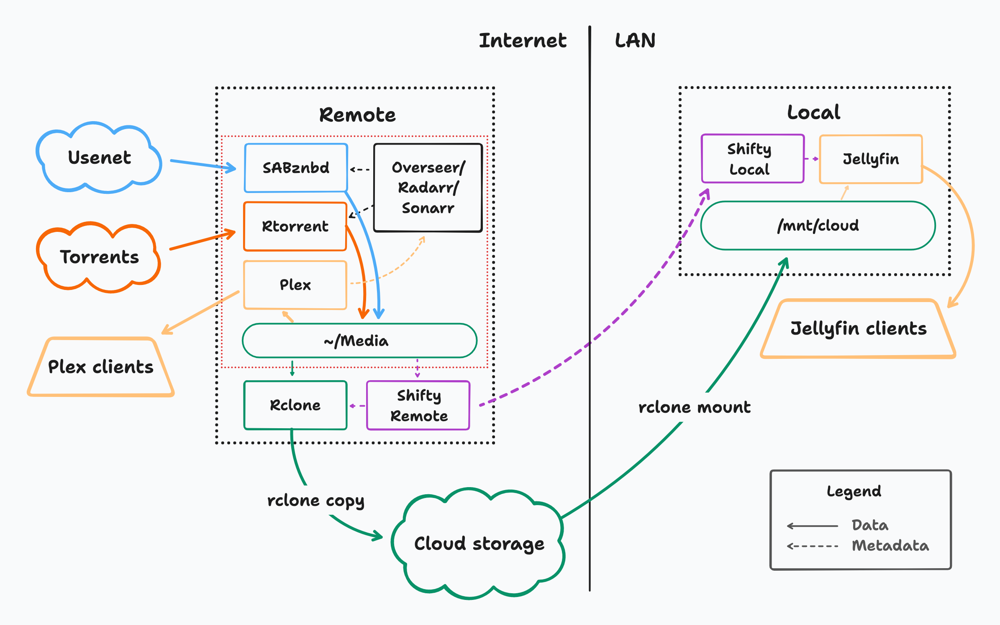

# Shifty — Architecture

The goal of this project is twofold: a) to make it easy to accumulate a large library of media without needing to manage or provision storage yourself, and b) to allow a local server on your home wifi to efficiently access this library as if it were a network drive.

The key is that Shifty is designed to work across two servers: a Remote server for requesting and downloading media, and the Local server for reliable playback while at home. While it's possible to run the same media server on both servers, we find it works best to treat Plex as remote-only and use something different (we recommend [Jellyfin](https://jellyfin.org/)) for local playback:

This might seem complex at first glance, but on the remote side, _the red dotted box is a completely standard seedbox setup_. As long as it places all downloaded/extracted/renamed files end up in a `~/Media` directory (or equivalent), Shifty will move them to the cloud and update your local box:

* When new files appear in `~/Media`, Shifty Remote tells rclone to start uploading them to your cloud storage.
* When complete, Shifty Remote tells Shifty Local which new files are present.
* Shifty Local invalidates its local rclone mount cache.
* Shifty Local then tells Jellyfin to update its library, which now sees the new content!

As a user, though, all you care about is this:

* I log into [Overseerr](https://overseerr.dev/) and request a Movie/Show
* In a few moments, it appears in Plex
* Several minutes later, it appears in Jellyfin!

Everything is powered by the magic of [rclone](https://rclone.org/), giving you fairly free choice of Cloud Storage providers.
